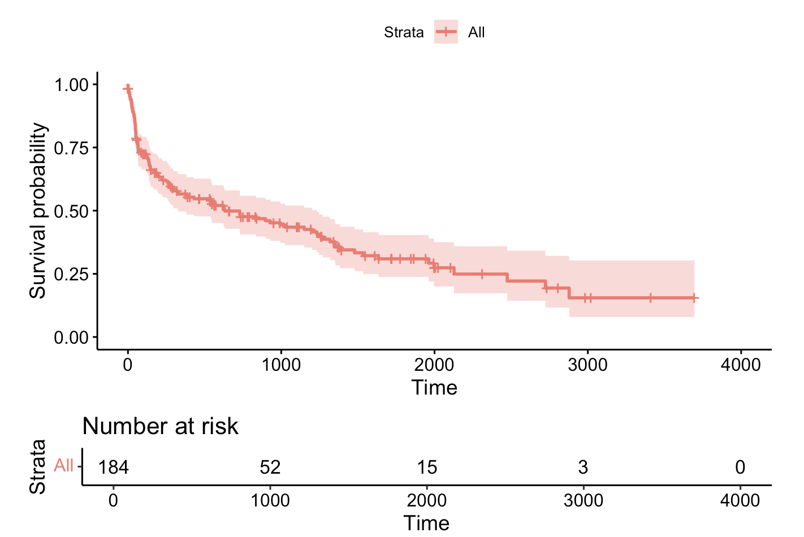
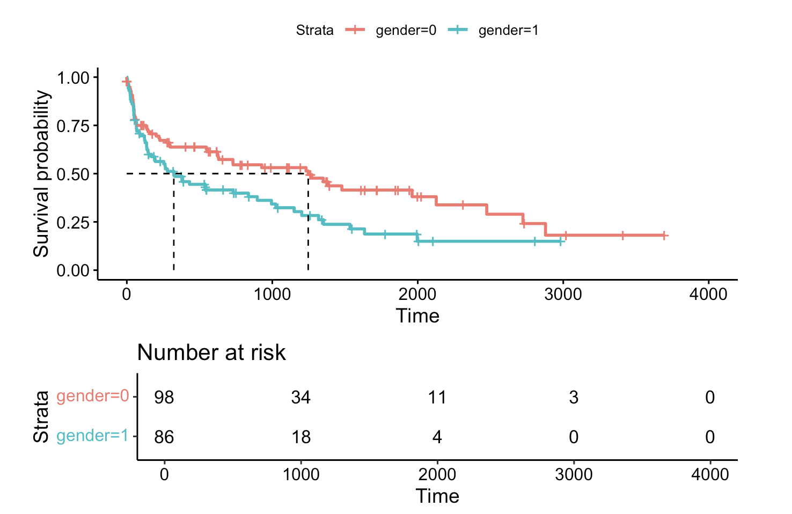
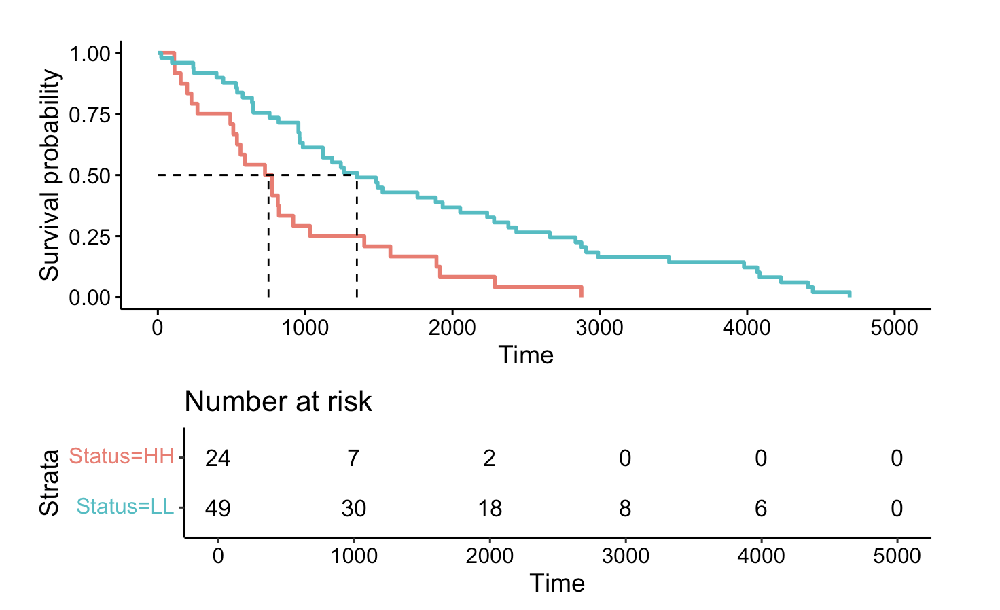
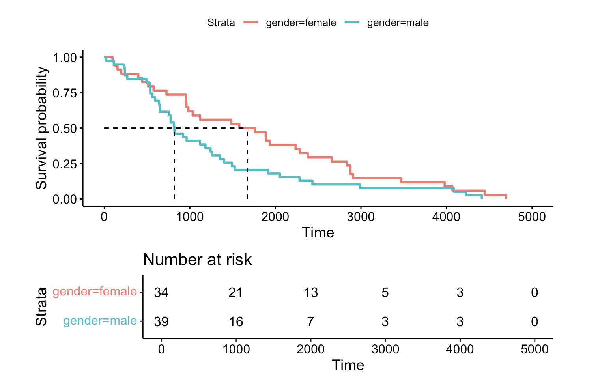
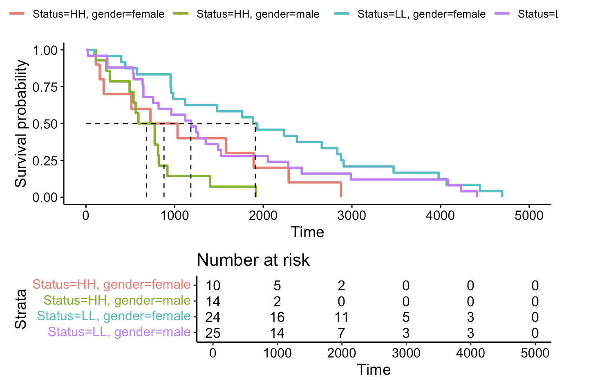
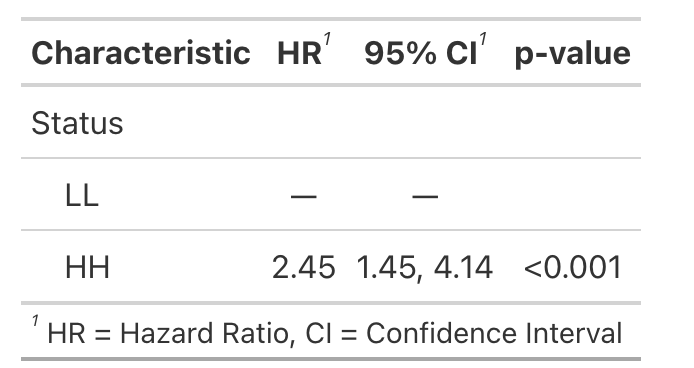
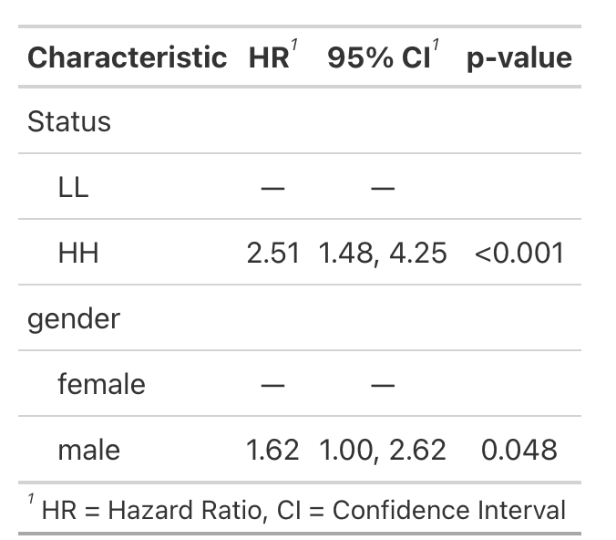
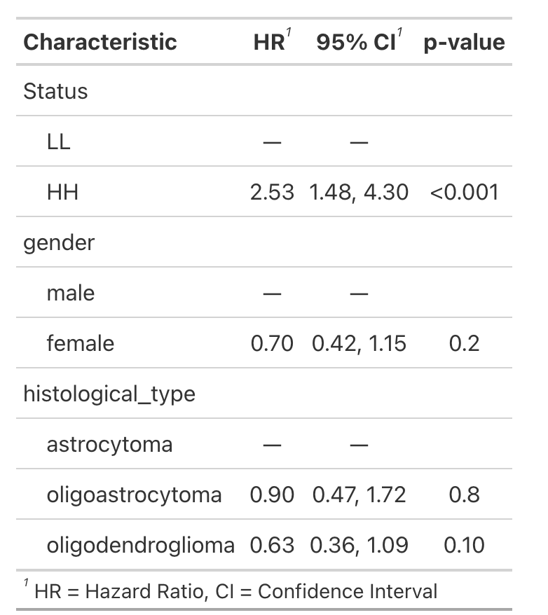

# Hands-on Survival analysis tutorial

The code used here is available in the `.Rmd` file in the folder.  The pdf and html versions are also listed for user reference/convenience.

- [Introduction](#Introduction)
- [Kaplan-Meier test](#kaplan-meier-test)
- [Log Rank Test](#log-rank-test)
- [Cox Proportional Hazard Ratio](#cox-proportional-hazard-ratio)
- [Landmark Analysis and Time Dependent Covariates](#landmark-analysis-and-time-dependent-covariates)
- [Refrences](#refrences)
- [Session Info](#session-info)


## Introduction

This hands on guide serves as an introduction to survival analysis, which, despite its name, encompasses a broad range of applications beyond the study of mortality. Survival analysis is a statistical method used to estimate the time until an event of interest occurs. It’s applicable in various scenarios, including but not limited to:
 - Determining the duration of effectiveness for a therapy before a relapse occurs.
 - Assessing the lifespan of a component within a vehicle or manufacturing setting prior to its replacement.
 - Evaluating the impact of a new banking security system on the incidence of hacking or fraud.
 - Analyzing the effect of a medication on a cancer patient’s survival.

These examples illustrate the versatility of survival analysis in measuring the time from the initiation of an observation to the occurrence of a specific event (e.g., therapy relapse, component failure, account breach, etc.). Typically, these studies are conducted within a predetermined timeframe, often dictated by funding constraints or the need to draw conclusions within a reasonable period. This introduces the concept of censoring in survival analysis. An observation is considered censored if the event of interest does not occur within the study period, if the event timing is not accurately captured (for example, a vehicle component fails but is only identified during a later inspection), or in clinical studies, if a participant withdraws before the study’s conclusion.

Survival analysis employs several key methodologies, including:

 **Kaplan-Meier test** : This method tracks the occurrence of events over time, aiming to determine the duration before a certain percentage of events occur, or the fraction of events happening by a specific time point. For example, it can estimate the time until 50% of patients experience a relapse following treatment. Kaplan-Meier curves effectively display survival discrepancies between two distinct categorical groups. However, they fall short in evaluating the impact of quantitative factors such as age, blodd pressure, gene expression among others. On the other hand, Cox Proportional Hazards (PH) regression is adept at examining the influence of both categorical and continuous variables, and it can

 **Log Rank test**: This test is useful for comparing the survival rates between two different interventions or methodologies. For example, it can compare the longevity of two types of dental fillings or the efficacy of two weight loss drugs. The test will provide p values to show the significance.

 **Cox Proportional Hazards Model**: This approach is taken when additional factors need to be considered in the analysis, such as comparing the effectiveness of two drugs while accounting for age, gender, smoking status, etc.

 **Landmark dependent Covariate analysis**: The above methodolgies include or examine covariate  that are being measured at baseline before the study time begins for the event.There would be scenerios where we would be interested in the covaraites measured after the start of the study time. Based on the study and research question a specific time point is chosen refered as “landmark” which is a fixed moment in time relative to the start of the study or the beginning of an individual’s follow-up period.

 **Time Dependent Covariates**: Sometimes the covariate that we are interested in changes during the course of the study with time. It is difficult to pick a “landmark” or a landmark may exclude large number of observations.

However we can quickly think of scenerios when the covariates may be changing during the study period. For example the number of servicing a machine equipment went through before the study end time, in clinal set the weight (BMI) of an individual is something that may change.

This overview underscores the fundamental concepts and applications of survival analysis, demonstrating its significance in a wide array of research and practical contexts.

For our study case we will 2 different datasets.

• **Stan**: This dataset includes data on the survival outcomes of patients who participated in the Stanford heart transplant program, here we will consider “follow-up” as an event.

• **miR10b-21_glioma**: This dataset focuses on the expression levels of microRNAs miR-10b and miR-21 in glioblastoma tumors. We aim to investigate whether the expression levels of these miRNAs in tumors affect patient survival rates.

    Important Notes:
Censoring Censoring is a crucial concept that deals with incomplete data. Censoring occurs when the exact time of the event of interest (such as death, failure, recovery) is not known for all subjects in the study. There are three main types of censoring: left, right, and interval censoring. Each type deals with different kinds of incomplete information:
1. Right Censoring: This is the most common form of censoring in survival analysis. Right censoring occurs when the event of interest has not happened yet at the time of analysis, or the study ends before the event occurs for some subjects. For example, if a study follows patients for 5 years after treatment, and a patient is still alive at the end of the study, their survival time is right-censored. We know they survived at least 5 years, but we do not know their total survival time.
2. Left Censoring: Left censoring occurs when the event of interest has already occurred before the subject starts being observed. For instance, if a study is looking at the duration of a certain condition and participants enter the study after they’ve already had the condition for an unknown amount of time, their exact starting time is unknown. We know that the event (onset of the condition) occurred, but we don’t know how long ago.
3. Interval Censoring: Interval censoring happens when the exact time of the event is not known, but here the event of interest (like tumor recurrence) could have happened at any time between visits. For instance, if a patient was disease-free at their 6-month visit but found to have a recurrence at their 12-month visit, the exact time of recurrence is unknown, only that it occurred within the 6 to 12-month interval.

These forms of censoring are critical to handle appropriately in survival analysis because they can significantly impact the estimation of survival functions and the interpretation of the study’s findings. Various statistical methods and models have been developed to account for these types of incomplete data.

**Encoding Note**: the Surv() function in the {survival} package accepts by default TRUE/FALSE, where TRUE is event and FALSE is censored; 1/0 where 1 is event and 0 is censored; or 2/1 where 2 is event and 1 is censored. Please take care to ensure the event indicator is properly formatted.

## Kaplan-Meier test

The method is commonly used for estimating survival time and probabilities.

**Load Packages**

The essential tools for conducting survival analysis are found within the survival packagea component of basic basic R setup. Load the package with library(survival) function. We will need tidyverse for data table manipulation and survminer and ggplot2 for better graphics. stan dataset is part of gss package, hence we will load that too.

```{r}
suppressPackageStartupMessages(library("tidyverse",quietly=TRUE))
suppressPackageStartupMessages(library("survival",quietly=TRUE))
suppressPackageStartupMessages(library("survminer",quietly=TRUE))
suppressPackageStartupMessages(library("ggplot2",quietly=TRUE))
suppressPackageStartupMessages(library("gss",quietly=TRUE))
suppressPackageStartupMessages(library(gtsummary,quietly=TRUE))
```

The functions we will be using in this section are Surv() and survfit(). Surv function will create a survival object to be used as response in a model formula. There time entry for each observation will be followed by + if it is censored.

```{r}
# Lets load the stan dataset
data(stan)

# explores dataset with head(stan) or ?stan
head(stan)
##   time status age    futime
## 1   15      1  54  3.872983
## 2    3      1  40  1.732051
## 3   46      1  42  6.782330
## 4  623      1  51 24.959968
## 5  126      1  48 11.224972
## 6   64      1  54  8.000000
```

Column IDs time Follow-up time after transplant, in days. status Censoring status. age Age at transplant. futime Square root of time.

All the entries under status are 1 so these are complete observations and are not censored.

```{r}
tail(stan)
##     time status age   futime
## 179   98      0  19 9.899495
## 180   89      0  27 9.433981
## 181   60      0  13 7.745967
## 182   56      0  27 7.483315
## 183    2      0  39 1.414214
## 184    1      0  27 1.000000
```

Entries at the bottom are censored observation with value 0 in status column.

```{r}
table(stan$status)
## 
##   0   1 
##  71 113
```
73 observations are censored and 113 are not.

As a first step we will create a survival object and this will include the time and censored information.
```{r}
Surv(stan$time, stan$status)[1:20]
##  [1]   15     3    46   623   126    64  1350    23   279  1024    10    39 
## [13]  730  1961   136     1   836    60  3695+ 1996
```

As we can notice that event time of subject1 is 15days, subject2 have 3days and so on. subject19 event time 3695 has + at end indicating its censored status.

In the next step we will fit a survival curve with survfir function. Let start with the simplest form of survival curve where we are not grouping subjects on any criteris. For this we specify just the intercept (~1) in the formula. We can then plot the curve with ggsurvplot() function from survminer package.

```{r}
surv_plot=survfit(Surv(time, status)~1, data=stan)

ggsurvplot(surv_plot,risk.table = TRUE)
```


**x-year Survival Estimation**

Occasionally we want to estimate the probability of surviving at fixed timelets say 180 days.

```{r}
surv_plot=survfit(Surv(time, status)~1, data=stan)

summary(survfit(Surv(time, status) ~ 1, data = lung), times = 180)

## Call: survfit(formula = Surv(time, status) ~ 1, data = lung)
## 
##  time n.risk n.event survival std.err lower 95% CI upper 95% CI
##   180    160      63    0.722  0.0298        0.666        0.783

```
This displays the survival probability at 180 days is 72% with 95 % confidence intervals displayed.

This include all the observations without grouping data. It would have been great if we had a gender information to group the subjects. For the sake of tutorial we will assign gender (0=female,1=male) and run the analysis by grouping the subjects. To perform grouping we will use ~ gender in the formula.

```{r}
# Assign random genders to 184 subjects

stan$gender<-sample(c(1,0),184, replace = TRUE)

head(stan)

##   time status age    futime gender
## 1   15      1  54  3.872983      1
## 2    3      1  40  1.732051      0
## 3   46      1  42  6.782330      1
## 4  623      1  51 24.959968      0
## 5  126      1  48 11.224972      1
## 6   64      1  54  8.000000      0
```

Now lets fit the curve after grouping subjects by gender that we assigned randomly.

```{r}
surv_plot2=survfit(Surv(time, status)~gender, data=stan)

ggsurvplot(surv_plot2,risk.table = TRUE, tables.height =0.35,surv.median.line = "hv" )
```



```{r}
# check ggsurvplot function for plot customization.
```
Lets run the survive probability at 180 days as we did before.

```{r}
summary(surv_plot2, times = 180)

## Call: survfit(formula = Surv(time, status) ~ gender, data = stan)
## 
##                 gender=0 
##         time       n.risk      n.event     survival      std.err lower 95% CI 
##     180.0000      63.0000      28.0000       0.7058       0.0468       0.6198 
## upper 95% CI 
##       0.8038 
## 
##                 gender=1 
##         time       n.risk      n.event     survival      std.err lower 95% CI 
##     180.0000      48.0000      35.0000       0.5880       0.0535       0.4919 
## upper 95% CI 
##       0.7028
```

This display the survival probability at 180 days is 70% in Females and 60% in males with 95 % confidence intervals displayed.

Lets use another different dataset. This dataset encompasses miRNA expression levels in glioblastoma tumors from various patients. The tumors are categorized into two distinct groups based on their expression levels of miR10b and miR21: one group exhibits high expression of both miRNAs, while the other demonstrates low expression of these miRNAs. A tumor sample is deemed to have high expression if its levels of both miR10b and miR21 surpass the 75th percentile threshold for each miRNA. Conversely, samples with expression levels below the 75th percentile for both miRNAs are classified as having low expression.

This data can be downloaded from here
```{r}
df<-read.csv("Gioblastoma_mir10b_21.csv")

colnames(df)
head(df)
##  [1] "X"                                   
##  [2] "Hybridization.REF"                   
##  [3] "mir.10b"                             
##  [4] "mir.21"                              
##  [5] "Status"                              
##  [6] "years_to_birth"                      
##  [7] "vital_status"                        
##  [8] "days_to_death"                       
##  [9] "days_to_last_followup"               
## [10] "tumor_tissue_site"                   
## [11] "gender"                              
## [12] "date_of_initial_pathologic_diagnosis"
## [13] "days_to_last_known_alive"            
## [14] "radiation_therapy"                   
## [15] "karnofsky_performance_score"         
## [16] "histological_type"                   
## [17] "race"                                
## [18] "ethnicity"                           
##   X Hybridization.REF   mir.10b   mir.21 Status years_to_birth vital_status
## 1 1      TCGA-HT-7882  28863.98 287880.7     HH             66            1
## 2 2      TCGA-DU-7007  58068.19 272269.1     HH             33            1
## 3 3      TCGA-DU-A76L  61145.90 168169.3     HH             54            1
## 4 4      TCGA-DU-7012  46382.01 155537.0     HH             74            1
## 5 5      TCGA-FG-5963 158927.59 105783.1     HH             23            1
## 6 6      TCGA-HT-A61C 154198.36  99753.8     HH             66            1
##   days_to_death days_to_last_followup      tumor_tissue_site gender
## 1           113                    NA central nervous system   male
## 2          1915                    NA central nervous system   male
## 3           814                    NA central nervous system   male
## 4           199                    NA central nervous system female
## 5           775                    NA central nervous system   male
## 6           537                    NA central nervous system   male
##   date_of_initial_pathologic_diagnosis days_to_last_known_alive
## 1                                 2010                       NA
## 2                                 1997                       NA
## 3                                 2000                       NA
## 4                                 2001                       NA
## 5                                 2009                       NA
## 6                                 2013                       NA
##   radiation_therapy karnofsky_performance_score histological_type
## 1                no                          NA oligodendroglioma
## 2              <NA>                          NA       astrocytoma
## 3               yes                          NA oligodendroglioma
## 4               yes                          NA       astrocytoma
## 5               yes                          90       astrocytoma
## 6               yes                         100 oligodendroglioma
##                        race              ethnicity
## 1                     white     hispanic or latino
## 2                     white not hispanic or latino
## 3                     white not hispanic or latino
## 4 black or african american not hispanic or latino
## 5                     white not hispanic or latino
## 6                     white not hispanic or latino
```

The columns that are importance from survival analysis are Status, days_to_death, gender.

**Status** : Expression of miR10b and miR21. HH (high expression), LL (low expression)

**days-to-death** : time to event

**gender** : Gender of individuals.

```{r}
cat("\n\n Observation in status category \n")
table(df$Status)

cat("\n\n Observation in gender category \n")
table(df$gender)
## 
## 
##  Observation in status category 
## 
## HH LL 
## 24 49 
## 
## 
##  Observation in gender category 
## 
## female   male 
##     34     39
```

Survival based on expression status.

```{r}
surv3=survfit(Surv(days_to_death)~Status, data=df)

ggsurvplot(surv3,risk.table = TRUE, tables.height =0.35,surv.median.line = "hv" )
```


---


#### Survival based on gender.

```{r}
surv4=survfit(Surv(days_to_death)~gender, data=df)

ggsurvplot(surv4,risk.table = TRUE, tables.height =0.35,surv.median.line = "hv" )
```


#### Survival based on expression status and gender.

```{r}
surv5=survfit(Surv(days_to_death)~Status+gender, data=df)

ggsurvplot(surv5,risk.table = TRUE, tables.height =0.35,surv.median.line = "hv" )
```


---
---


## Log Rank Test

The **Log Rank Test** is a statistical procedure used to evaluate the significance of differences in survival rates between two groups. This test is particularly useful in the context of survival analysis, where the primary interest is to understand how different factors (such as treatment groups in clinical trials, demographic variables, or other categorical predictors) affect the probability of a certain event over time, typically events like death, failure, or relapse.

The essence of the Log Rank Test lies in its comparison of the observed survival outcomes against the expected outcomes if there were no true difference between the groups. It does this across the entire duration of a study, effectively taking into account the time until each event occurs. This aspect makes the test especially powerful for analyzing time-to-event data, which is often censored (i.e., the event has not occurred for some subjects by the end of the study).

Key features of the Log Rank Test include:

- **Equal weighting of time points**- : Each time point in the follow-up period is given equal importance. This means the test does not inherently emphasize differences at early or late stages in the follow-up, although variations of the test can be applied to focus on these aspects.

- **Non-parametric nature**: The Log Rank Test does not assume a specific distribution for the survival times, making it broadly applicable across various types of survival data.

- **Comparative analysis**: While primarily designed for comparing two groups, the Log Rank Test can be extended to compare multiple groups, facilitating more complex survival analyses.

- **Sensitivity to changes in survival rates**: The test is particularly sensitive to differences in survival rates between groups over the duration of the study, making it a preferred choice for many clinical and epidemiological studies.

In practice, the Log Rank Test calculates a test statistic that, under the null hypothesis (assuming no difference between groups), follows a chi-square distribution. Researchers can then use this statistic to determine a p-value, which indicates the probability of observing the detected difference (or a more extreme difference) if the null hypothesis were true. A low p-value suggests that the observed differences in survival rates between the groups are statistically significant, indicating that factors distinguishing the groups might influence survival.

To get the log-rank p-value we will use survdiff function.

```{r}
survdiff(Surv(time, status) ~ gender, data = stan)

# check ggsurvplot function for plot customisation.
## Call:
## survdiff(formula = Surv(time, status) ~ gender, data = stan)
## 
##           N Observed Expected (O-E)^2/E (O-E)^2/V
## gender=0 98       53     66.1      2.58      6.33
## gender=1 86       60     46.9      3.63      6.33
## 
##  Chisq= 6.3  on 1 degrees of freedom, p= 0.01
```

The results suggest survival difference between male and female is not significant with pvalue threshold of 0.05. The pvalue in out test is 0.1.

Now lets run the log rank test on glioma datasets.
```{r}
survdiff(Surv(days_to_death)~Status, data=df) 

## Call:
## survdiff(formula = Surv(days_to_death) ~ Status, data = df)
## 
##            N Observed Expected (O-E)^2/E (O-E)^2/V
## Status=HH 24       24     13.1      9.05      11.9
## Status=LL 49       49     59.9      1.98      11.9
## 
##  Chisq= 11.9  on 1 degrees of freedom, p= 6e-04
```

There is significant difference between in survival rates between high and low expression of miR10b and miR21.

```{r}
survdiff(Surv(days_to_death)~gender, data=df)
## Call:
## survdiff(formula = Surv(days_to_death) ~ gender, data = df)
## 
##                N Observed Expected (O-E)^2/E (O-E)^2/V
## gender=female 34       34     41.9      1.48      3.68
## gender=male   39       39     31.1      2.00      3.68
## 
##  Chisq= 3.7  on 1 degrees of freedom, p= 0.06
```

There is no significant difference between in survival rates between genders.

```{r}
survdiff(Surv(days_to_death)~Status+gender, data=df)
## Call:
## survdiff(formula = Surv(days_to_death) ~ Status + gender, data = df)
## 
##                           N Observed Expected (O-E)^2/E (O-E)^2/V
## Status=HH, gender=female 10       10     7.17    1.1196   1.27408
## Status=HH, gender=male   14       14     5.94   10.9280  12.82265
## Status=LL, gender=female 24       24    34.72    3.3083   6.78888
## Status=LL, gender=male   25       25    25.17    0.0012   0.00189
## 
##  Chisq= 17  on 3 degrees of freedom, p= 7e-04
```

There is significant difference between in survival rates between high and low expression of miR10b and miR21 combined with genders covariates.

---
---

## Cox Proportional Hazard Ratio:

The Cox proportional hazard ratio or Cox Refression model estimates the effect of one or multiple variables. The Cox proportional hazard ratio is a semi-parametric model that measures survival outcome based univariable and multivariable regression models. Lets run the analysis om the miR-10b-21 dataset.

The function we use will be coxph on the survival object generated using Surv function
```{r}
# Setting reference levels
df$Status<-relevel(as.factor(df$Status),ref="LL")

coxph(Surv(days_to_death)~Status, data=df)%>% 
  tbl_regression(exp = TRUE) 
```



Here we have LL as the reference level and compared to that HH samples have 2.45 fold higher chances of facing an event. This difference is significant with pvalue <0.001.

We can include more variables in analysis e.g gender

```{r}
# Setting reference levels
df$Status<-relevel(as.factor(df$Status),ref="LL")
df$gender<-relevel(as.factor(df$gender),ref="female")

coxph(Surv(days_to_death)~Status+gender, data=df)%>% 
  tbl_regression(exp = TRUE)
``` 


Now we have the results based on gender indicating Males have 1.62fold less survival rates than females with p<0.05, hence significant.
```{r}
# Setting reference levels
df$Status<-relevel(as.factor(df$Status),ref="LL")
df$gender<-relevel(as.factor(df$gender),ref="male")
df$histological_type<-relevel(as.factor(df$histological_type),ref="astrocytoma")
coxph(Surv(days_to_death)~1+Status+gender+histological_type, data=df) %>%
  tbl_regression(exp = TRUE) 
```


This displays hazard ratio in each case compared to reference.

---
---

## Landmark Analysis and Time Dependent Covariates

In landmark analysis, the methodology remains consistent with previous functions, with the primary adjustment being the modification of time to account for a specified landmark. For example, if the landmark is set at 60 days, one would subtract 60 days from the total observed time for each subject. This adjusted time, referred to as “new time,” is then used in the analysis. Subjects or observations lacking sufficient follow-up to reach the landmark (e.g., less than 60 days) are excluded from this analysis.

The Kaplan-Meier estimator, Log Rank test, and Cox regression model are conducted as before, utilizing this adjusted timeline.

For handling time-dependent covariates, where a fixed landmark time is not applicable, data must be structured to accommodate changes in covariate status over time. This involves creating multiple entries for individuals to reflect periods before and after a covariate change. Specifically, one entry captures the time from the study’s start to when the covariate change occurs, and a second entry records the time from this change to the study’s conclusion or to another subsequent change.

To analyze time-dependent covariates, the coxph function is employed, with the dataset formatted to accurately represent these intervals and changes in covariate status over the course of the study. This approach allows for a dynamic examination of how covariates that evolve over time impact the study’s outcomes.

```{r}
#Original Dataset
##   my_id   T1 delta1   TA deltaA
## 1     1 2081      0   67      1
## 2     2 1602      0 1602      0
## 3     3 1496      0 1496      0
## 4     4 1462      0   70      1
## 5     5 1433      0 1433      0


#formatted for analysis Dataset
##   id   T1 delta1 tstart tstop death agvhd
## 1     1 2081      0      0    67     0     0
## 2     1 2081      0     67  2081     0     1
## 3     2 1602      0      0  1602     0     0
## 4     3 1496      0      0  1496     0     0
## 5     4 1462      0      0    70     0     0
## 6     4 1462      0     70  1462     0     1
## 7     5 1433      0      0  1433     0     0


coxph(
  Surv(time = tstart, time2 = tstop, event = death) ~ agvhd, data = inputdata) %>% 
  tbl_regression(exp = TRUE)
```

**UNder construction** 

---
---

## Refrences

The tutorial is inspired from. the following sources

-1. Clark, T., Bradburn, M., Love, S., & Altman, D. (2003). Survival analysis part I: Basic concepts and first analyses. 232-238. ISSN 0007-0920.

-2. M J Bradburn, T G Clark, S B Love, & D G Altman. (2003). Survival Analysis Part II: Multivariate data analysis – an introduction to concepts and methods. British Journal of Cancer, 89(3), 431-436.

-3 .Bradburn, M., Clark, T., Love, S., & Altman, D. (2003). Survival analysis Part III: Multivariate data analysis – choosing a model and assessing its adequacy and fit. 89(4), 605-11.

-4. Clark, T., Bradburn, M., Love, S., & Altman, D. (2003). Survival analysis part IV: Further concepts and methods in survival analysis. 781-786. ISSN 0007-0920.

-5. https://www.emilyzabor.com/tutorials/survival_analysis_in_r_tutorial.html

-6. https://bioconnector.github.io/workshops/r-survival.html#rtcga

---
---

## Session Info


```
sessionInfo()
## R version 4.3.1 (2023-06-16)
## Platform: aarch64-apple-darwin20 (64-bit)
## Running under: macOS Sonoma 14.2.1
## 
## Matrix products: default
## BLAS:   /Library/Frameworks/R.framework/Versions/4.3-arm64/Resources/lib/libRblas.0.dylib 
## LAPACK: /Library/Frameworks/R.framework/Versions/4.3-arm64/Resources/lib/libRlapack.dylib;  LAPACK version 3.11.0
## 
## locale:
## [1] en_US.UTF-8/en_US.UTF-8/en_US.UTF-8/C/en_US.UTF-8/en_US.UTF-8
## 
## time zone: America/New_York
## tzcode source: internal
## 
## attached base packages:
## [1] stats     graphics  grDevices utils     datasets  methods   base     
## 
## other attached packages:
##  [1] gtsummary_1.7.2 gss_2.2-7       survminer_0.4.9 ggpubr_0.6.0   
##  [5] survival_3.5-7  lubridate_1.9.3 forcats_1.0.0   stringr_1.5.1  
##  [9] dplyr_1.1.4     purrr_1.0.2     readr_2.1.5     tidyr_1.3.1    
## [13] tibble_3.2.1    ggplot2_3.5.0   tidyverse_2.0.0
## 
## loaded via a namespace (and not attached):
##  [1] gtable_0.3.4         xfun_0.42            bslib_0.6.1         
##  [4] rstatix_0.7.2        lattice_0.22-5       tzdb_0.4.0          
##  [7] vctrs_0.6.5          tools_4.3.1          generics_0.1.3      
## [10] fansi_1.0.6          highr_0.10           pkgconfig_2.0.3     
## [13] Matrix_1.6-5         data.table_1.15.0    gt_0.10.1           
## [16] lifecycle_1.0.4      farver_2.1.1         compiler_4.3.1      
## [19] munsell_0.5.0        carData_3.0-5        htmltools_0.5.7     
## [22] sass_0.4.8           yaml_2.3.8           pillar_1.9.0        
## [25] car_3.1-2            jquerylib_0.1.4      ellipsis_0.3.2      
## [28] broom.helpers_1.14.0 cachem_1.0.8         abind_1.4-5         
## [31] km.ci_0.5-6          commonmark_1.9.1     tidyselect_1.2.0    
## [34] digest_0.6.34        stringi_1.8.3        labeling_0.4.3      
## [37] splines_4.3.1        labelled_2.12.0      fastmap_1.1.1       
## [40] grid_4.3.1           colorspace_2.1-0     cli_3.6.2           
## [43] magrittr_2.0.3       utf8_1.2.4           broom_1.0.5         
## [46] withr_3.0.0          scales_1.3.0         backports_1.4.1     
## [49] timechange_0.3.0     rmarkdown_2.25       ggtext_0.1.2        
## [52] gridExtra_2.3        ggsignif_0.6.4       zoo_1.8-12          
## [55] hms_1.1.3            evaluate_0.23        haven_2.5.4         
## [58] knitr_1.45           KMsurv_0.1-5         markdown_1.12       
## [61] survMisc_0.5.6       rlang_1.1.3          Rcpp_1.0.12         
## [64] gridtext_0.1.5       xtable_1.8-4         glue_1.7.0          
## [67] xml2_1.3.6           rstudioapi_0.15.0    jsonlite_1.8.8      
## [70] R6_2.5.1
```