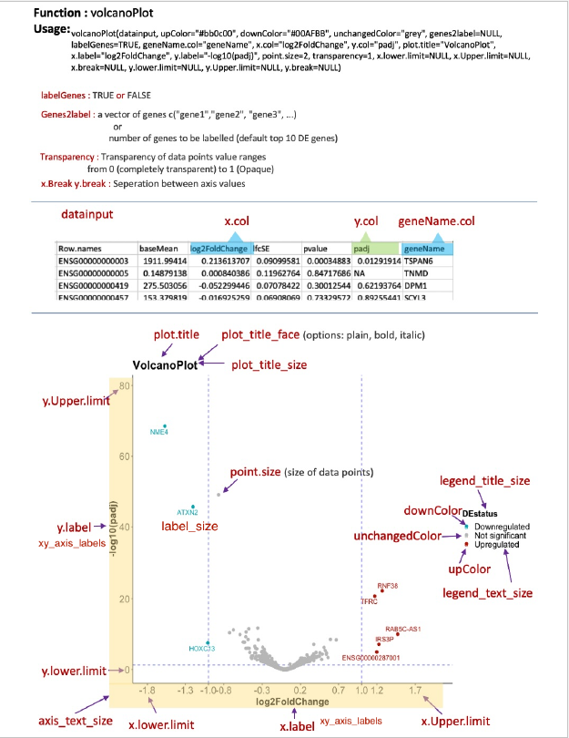

## Volcano plot

A volcano plot is a type of scatter plot used primarily in genomics and other biological research to visualize the results of high-throughput data analysis, particularly in identifying significant changes in gene expression or protein abundance. On the x-axis, it shows the log fold change, representing the magnitude of difference between two groups, while the y-axis displays the negative logarithm of the p-value, indicating the statistical significance of those differences. The plot often resembles the shape of a volcano because the most significant and substantial changes form "wings" at the top, highlighting genes or proteins that are both highly differentiated and statistically significant. This visual approach simplifies the identification of critical biomarkers or genetic markers for further research.  

There are different scripts and codes are available to generate volcanoplots, some very simple others a bit complex.  Here is the code  with a visual help file that can help you to change apparoprite paraneters to modify your plots. 

Every aspect of the plot is customisable.

**`datainput`** :     The input data can be a csv file ot .txt file with log2Fold change column and column with significance column.  Additional columns are optional.  

**`upColor="#bb0c00"`** :  Colur used for showing upregulated significant genes. Default : Red

**`downColor="blue2"`**:  Colur used for showing downregulated significant genes. Default : blue

**`unchangedColor="grey"`** :    Colur used for showing non-significant genes. Default : grey

**`labelGenes=FALSE`** :   Label genes (TRUE or FALSE), Default : FALSE

**`geneName.col="gene_name"`** :    Column in the input data table that has to be used as GeneID's.  If the geneID's are rownames then add them as a column to data frame and use that column ID.

**`x.col="log2FoldChange"`** :     Column in the input data to be used to represent effect sixe, FoldChange.  Preferabbly log2FoldChange.

**`y.col="padj"`** :    Column in the input table to represent significance (could be padj value or pvalues)

**`genes2label=NULL`** :   Option to specify datapoints on the plot to be labelled with the `geneName.col` ID's. Deafult label top 10 DE genes.  A custom list of genes can be provided as vector e.g. ` c("gene1", "gene2"...)`

**`plot.title="VolcanoPlot"`** :    Title of plot

**`x.label="log2FoldChange"`** :    Label on x-axis

**`y.label="-log10(padj)"`** :    label on y-axis

**`point.size=2`** :    Size of data points.  Increase and decrease as per need.

**`transparency=1`** :     Transparency of data points. Values from 0-1 (completely.transparent-opaque)

**`x.lower.limit=NULL`** :   Set lowet limit of x-axis.

**`x.Upper.limit=NULL`** :  Set Upper limit of x-axis  

**`x.break=NULL`** :    Specify divisons in x-axis.(ticks)

**`y.lower.limit=NULL`** :    Set lower limit of y-axis

**`y.Upper.limit=NULL`** :    Set Upper limit of y-axis

**`y.break=NULL`** :  Specify divisons on y-axis (ticks)    

**`axis_text_size=5`** :    The size of tick mark text on x and y axis.

**`legend_title_size=12`** :  This is for the size of the legend title describing data       point colours.    

**`legend_text_size=8`** :    This is for the size of the legend text describing data point colours.

**`plot_title_size=12`** :  Text size of plot title    

**`plot_title_face="bold"`** :    Text type of plot title

**`label_size=5`** :    Text size of gene names used to label data points.

**`xy_axis_labels=14`** :   Text size of X and Y-axis labels. 

**`lfc_cut_off=1`**  :  Log2Fold change cut of, position where vertical lines will be plotted to identify fold change threshold.

*If you find it useful and have some comments to improve it further please raise and issue / suggestion.*
